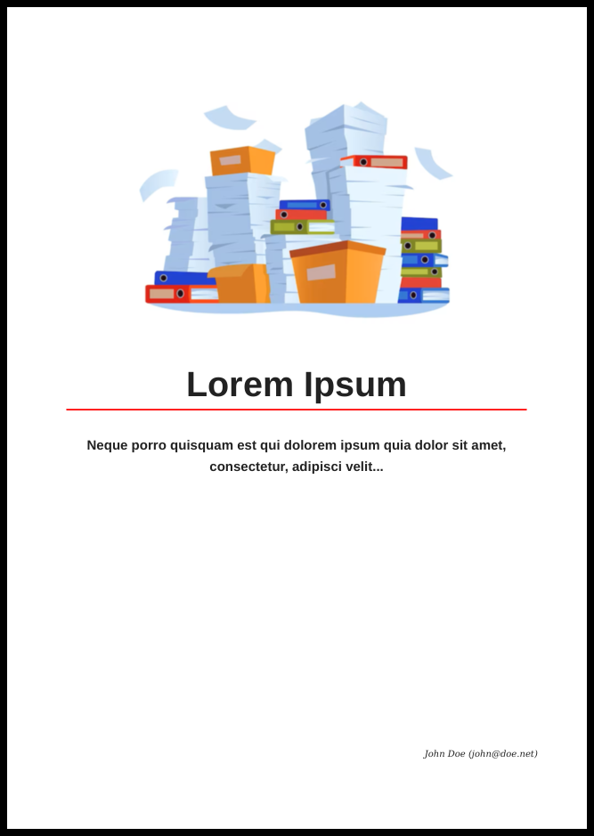

The objective of this project is to enhance the user experience of building a PDF file based on markdown files. This is achieved through the use of a docker image, which has all the necessary software packages preinstalled.

<div align="center">

</div>

This tutorial was created by Norbert EHART (norbert@ehart.net) in 2023 under the CC-BY licence.

It is critical to ensure that the correct file and folder permissions are in place by executing the DOCKER commands as a non-root user.

```text
sudo bash
```

```xml
usermod -aG docker <USERNAME>
```

```xml
exit
```

Then, we need to create the `compose.yml` and `env.conf` file within your documentation directory.

```text
wget --quiet "https://gitlab.ans.co.at/templates/mkpdf/-/raw/main/tmpl/compose.yml"
```

```text
wget --quiet "https://gitlab.ans.co.at/templates/mkpdf/-/raw/main/tmpl/env.conf"
```

Next, it is necessary to modify the `env.conf` file in alignment with your specific requirements.

```text
vi env.conf
```

In the event that a new project needs to be created, the command below must be used. This will generate the project configuration files (`mkbase.yml` and `mkdocs.yml`), as well as a directory called `pages` that will contain your MARKDOWN source files. Typically, there is no need to alter the configuration files unless modifications are required to the template.

```text
docker compose run --rm --user $(id -u):$(id -g) mkpdf init
```

In the event that the template has already been used and requires an update, use the following command to update the image to the latest version available on `https://gitlab.ans.co.at`.

```text
docker compose pull
```

The development server can be initiated with the command below, after which the writing process can start. The URL for accessing the development website can be found in the command output. The live-reloading feature is enabled in this template, which means in the event of a change in the `pages` directory or the configuration files, the website will reload automatically and display the updated content immediately. By default, only the `index.md` file will be rendered into the PDF file.

```text
docker compose run --rm --user $(id -u):$(id -g) mkpdf serve
```

In order to build the PDF file, you can use the following command. This will result in the generation of a file called `document.pdf` within the documentation directory.

```text
docker compose run --rm --user $(id -u):$(id -g) mkpdf build
```
