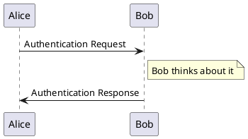

# MARKDOWN

Pellentesque ut ex iaculis, hendrerit odio tincidunt, scelerisque mauris. Mauris lobortis nisl vel orci auctor, id suscipit odio dignissim. Nulla facilisi. Aenean ac feugiat nunc. Sed dictum, metus et mattis scelerisque, lorem leo efficitur erat, vel ornare ex dolor in ligula. Nunc ut placerat urna, id gravida neque. Maecenas sed lobortis odio, vel pretium risus. Donec finibus bibendum nulla. Class aptent taciti sociosqu ad litora torquent per conubia nostra, per inceptos himenaeos. Nam posuere tellus sit amet turpis auctor, faucibus fermentum orci tempor. Vestibulum dictum consequat arcu, vitae ornare urna volutpat at.
<a href="https://blog.greenroots.info/20-useful-markdown-syntaxes-for-developers" target="_blank">[https://blog.greenroots.info]</a>

Fusce sed elementum quam. Phasellus ut dolor a sapien gravida sagittis sodales a nulla. Mauris quis nunc auctor, tristique quam feugiat, dapibus leo. Phasellus a cursus tellus, eget porttitor nunc. Donec porttitor tellus sed volutpat luctus. Nullam eleifend a lacus porttitor dictum. Donec vel placerat risus, id aliquet ex. Vestibulum in leo quis purus pharetra tincidunt. Vivamus blandit, arcu ac tempus cursus, ex dui consectetur augue, sed lobortis justo metus ut nisl. Suspendisse sed placerat mauris, sit amet varius nulla.
<a href="https://www.markdownguide.org/getting-started/" target="_blank">[https://www.markdownguide.org]</a>

Nunc lorem turpis, blandit non scelerisque et, mollis in lectus. Nullam congue mi in arcu lobortis, id pharetra purus aliquam. Fusce ultricies dapibus maximus. Nullam magna massa, ullamcorper in erat sit amet, varius fringilla lacus. Phasellus scelerisque ullamcorper elit, et hendrerit elit sagittis non. Mauris mollis tortor eget pulvinar pretium. Nunc suscipit a diam sit amet commodo.
<a href="https://www.markdownguide.org/getting-started/" target="_blank">[https://www.markdownguide.org]</a>

## ITALIC Text

Nunc *lorem* turpis, blandit non scelerisque et, mollis in lectus. Nullam congue mi in arcu lobortis, id pharetra purus aliquam. Fusce ultricies dapibus maximus. Nullam magna massa, ullamcorper in erat sit amet, varius fringilla lacus. Phasellus scelerisque ullamcorper elit, et hendrerit elit sagittis non. Mauris mollis tortor eget pulvinar pretium. Nunc suscipit a diam sit amet commodo.
<a href="https://experienceleague.adobe.com/en/docs/contributor/contributor-guide/writing-essentials/markdown" target="_blank">[https://experienceleague.adobe.com]</a> 
<a href="https://blog.greenroots.info/20-useful-markdown-syntaxes-for-developers" target="_blank">[https://blog.greenroots.info]</a> 
<a href="https://www.ionos.com/digitalguide/websites/web-development/markdown/" target="_blank">[https://www.ionos.com]</a>

## BOLD Text

Nunc **lorem** turpis, blandit non scelerisque et, mollis in lectus. Nullam congue mi in arcu lobortis, id pharetra purus aliquam. Fusce ultricies dapibus maximus. Nullam magna massa, ullamcorper in erat sit amet, varius fringilla lacus. Phasellus scelerisque ullamcorper elit, et hendrerit elit sagittis non. Mauris mollis tortor eget pulvinar pretium. Nunc suscipit a diam sit amet commodo. 
<a href="https://experienceleague.adobe.com/en/docs/contributor/contributor-guide/writing-essentials/markdown" target="_blank">[https://experienceleague.adobe.com]</a> 
<a href="https://blog.greenroots.info/20-useful-markdown-syntaxes-for-developers" target="_blank">[https://blog.greenroots.info]</a> 
<a href="https://www.ionos.com/digitalguide/websites/web-development/markdown/" target="_blank">[https://www.ionos.com]</a>

## ITALIC & BOLD Text

Nunc ***lorem*** turpis, blandit non scelerisque et, mollis in lectus. Nullam congue mi in arcu lobortis, id pharetra purus aliquam. Fusce ultricies dapibus maximus. Nullam magna massa, ullamcorper in erat sit amet, varius fringilla lacus. Phasellus scelerisque ullamcorper elit, et hendrerit elit sagittis non. Mauris mollis tortor eget pulvinar pretium. Nunc suscipit a diam sit amet commodo.
<a href="https://experienceleague.adobe.com/en/docs/contributor/contributor-guide/writing-essentials/markdown" target="_blank">[https://experienceleague.adobe.com]</a> 
<a href="https://blog.greenroots.info/20-useful-markdown-syntaxes-for-developers" target="_blank">[https://blog.greenroots.info]</a> 
<a href="https://www.ionos.com/digitalguide/websites/web-development/markdown/" target="_blank">[https://www.ionos.com]</a>

## STRIKETHROUGH

Fusce {--interdum--} nulla in velit mollis pretium in et nunc. {--Cras in congue quam--}.
<a href="https://squidfunk.github.io/mkdocs-material/reference/formatting/" target="_blank">[https://squidfunk.github.io]</a> 

## HIGHLIGHTING

Fusce {++interdum++} nulla in velit mollis {==pretium==} in et nunc.
<a href="https://squidfunk.github.io/mkdocs-material/reference/formatting/" target="_blank">[https://squidfunk.github.io]</a> 

Curabitur aliquet accumsan quam id fringilla. Donec euismod blandit eros, eget ullamcorper sem dictum eget. Integer eu sem eu dolor lobortis efficitur. Morbi convallis semper interdum. Proin porta leo maximus, efficitur lacus non, porta sapien. Fusce in purus vel est cursus rutrum at ut lorem. Vivamus luctus sapien at ligula ultrices ornare.
<a href="https://squidfunk.github.io/mkdocs-material/reference/formatting/" target="_blank">[https://squidfunk.github.io]</a> 

{==

Pellentesque sem arcu, laoreet eu vestibulum ac, tincidunt vitae mi. Pellentesque eu facilisis risus, vel dictum felis. Maecenas malesuada est rhoncus eros hendrerit venenatis id et risus. Pellentesque dolor ante, efficitur nec odio id, fringilla auctor justo. Nunc venenatis erat vitae arcu auctor fermentum. Nunc convallis dui lorem, eu facilisis ligula mattis vel. Nulla et finibus lorem. Suspendisse potenti.
<a href="https://squidfunk.github.io/mkdocs-material/reference/formatting/" target="_blank">[https://squidfunk.github.io]</a> 

==}

Nam posuere facilisis rhoncus. Aenean sollicitudin mollis libero, sit amet egestas magna malesuada vitae. Curabitur gravida suscipit metus, eget dictum nisl varius vitae. Aliquam consectetur odio pellentesque libero vehicula pulvinar. Nullam tincidunt tempor enim, eu bibendum mi auctor quis. Donec in felis lacus. Duis vel neque velit. Morbi vel sapien dapibus eros bibendum vulputate et eu ante. Aenean id augue elementum nulla ultrices tincidunt. Donec eu tortor lacus. Phasellus tempor quam vitae neque auctor, eu dictum tortor malesuada. Nunc orci urna, ultrices at hendrerit nec, blandit vel justo. Donec rutrum sem sem, nec blandit mauris mattis in. Suspendisse dolor velit, tempus et vehicula ac, scelerisque ac diam. Vivamus augue nulla, sollicitudin nec finibus sit amet, molestie id mauris.
<a href="https://squidfunk.github.io/mkdocs-material/reference/formatting/" target="_blank">[https://squidfunk.github.io]</a> 

Curabitur aliquet `accumsan quam id` fringilla. Donec euismod blandit eros, eget ullamcorper sem dictum eget. Integer eu sem eu dolor lobortis efficitur. Morbi convallis semper interdum. Proin porta leo maximus, efficitur lacus non, porta sapien. Fusce in purus vel est cursus rutrum at ut lorem. Vivamus luctus sapien at ligula ultrices ornare.
<a href="https://squidfunk.github.io/mkdocs-material/reference/formatting/" target="_blank">[https://squidfunk.github.io]</a> 

## SUB- AND SUPERSCRIPTS

Pellentesque sem arcu, laoreet eu vestibulum a~2~c, tincidunt vitae m^T^i.
<a href="https://squidfunk.github.io/mkdocs-material/reference/formatting/" target="_blank">[https://squidfunk.github.io]</a> 

# LINE BREAK

Mauris facilisis convallis pulvinar. Aenean porttitor purus in nulla bibendum convallis. Quisque tempor semper porttitor. Aenean fringilla enim efficitur tincidunt tempor. Sed vitae purus nunc. Maecenas sit amet sem non velit mattis porta ac sit amet purus. Aliquam id convallis felis. In a varius augue, id finibus nulla. Pellentesque habitant morbi tristique senectus et netus et malesuada fames ac turpis egestas. Interdum et malesuada fames ac ante ipsum primis in faucibus.
<a href="https://www.markdownguide.org/basic-syntax/" target="_blank">[https://www.markdownguide.org]</a>

***(1)*** Nulla vitae bibendum nisl. Pellentesque habitant morbi tristique senectus et netus et malesuada fames ac turpis egestas. <br>
***(2)*** Integer convallis, libero sit amet laoreet convallis, augue libero tristique leo, sed ultrices lorem urna malesuada metus. <br>
***(3)*** Class aptent taciti sociosqu ad litora torquent per conubia nostra, per inceptos himenaeos.

Aenean vitae felis at quam tincidunt imperdiet. Nullam pulvinar orci arcu, et feugiat dui pharetra vitae. Nam eu arcu nisl. Vestibulum mattis tortor eu diam hendrerit interdum. Orci varius natoque penatibus et magnis dis parturient montes, nascetur ridiculus mus. Interdum et malesuada fames ac ante ipsum primis in faucibus. Quisque ut eros a purus fringilla blandit.
<a href="https://www.markdownguide.org/basic-syntax/" target="_blank">[https://www.markdownguide.org]</a>

# INCLUDEs

Curabitur aliquet accumsan quam id fringilla. Donec euismod blandit eros, eget ullamcorper sem dictum eget. Integer eu sem eu dolor lobortis efficitur. Morbi convallis semper interdum. Proin porta leo maximus, efficitur lacus non, porta sapien. Fusce in purus vel est cursus rutrum at ut lorem. Vivamus luctus sapien at ligula ultrices ornare.
<a href="https://github.com/mondeja/mkdocs-include-markdown-plugin" target="_blank">[https://github.com]</a>

{!
    include-markdown "example.md"
!}

Mauris maximus porttitor dapibus. Maecenas eget egestas diam. Curabitur eget tristique diam. Vestibulum lobortis nunc sed libero fringilla auctor. Praesent mollis a urna sed iaculis. Donec pulvinar lorem eu urna lacinia egestas. Integer nec blandit tortor. Donec ac magna elementum, ultricies libero non, consequat risus. Duis et orci urna. Ut sapien arcu, posuere vel molestie vitae, porttitor euismod ante. Mauris vehicula posuere orci, vitae efficitur lectus facilisis at.
<a href="https://github.com/mondeja/mkdocs-include-markdown-plugin" target="_blank">[https://github.com]</a>

# LISTS

Markdown supports the ability to create ordered lists using numbers as well as unordered lists using bullets.
<a href="https://learn.microsoft.com/en-us/azure/devops/project/wiki/markdown-guidance?view=azure-devops" target="_blank">[https://learn.microsoft.com]</a>

  * First unordered Item
  * Second unordered Item
  * Third unordered Item

Ordered lists must begin with a number followed by a full stop for each item on the list, and unordered lists must begin with a asterisk.
<a href="https://learn.microsoft.com/en-us/azure/devops/project/wiki/markdown-guidance?view=azure-devops" target="_blank">[https://learn.microsoft.com]</a>

  1. First ordered Item
  2. Second ordered Item
  3. Third ordered Item

# TABLES

Vivamus at sapien ac augue facilisis dignissim ut in turpis. Sed eget mi cursus, dignissim ante vitae, consequat eros. Cras ultricies venenatis eros, id feugiat ex sodales ut. Maecenas enim lorem, laoreet eget eleifend et, pretium vel eros. Etiam nibh felis, rhoncus ut hendrerit vel, ultricies et leo. Curabitur feugiat justo sapien, at ullamcorper lacus placerat non. Vestibulum eget pretium arcu, ut viverra lorem. Nulla interdum pulvinar turpis, sed pretium mi ullamcorper non. Pellentesque eget urna in diam aliquam convallis eget ut metus.
<a href="https://squidfunk.github.io/mkdocs-material/reference/data-tables/" target="_blank">[https://squidfunk.github.io]</a>
<a href="https://facelessuser.github.io/pymdown-extensions/extensions/blocks/plugins/html/" target="_blank">[https://facelessuser.github.io]</a>

/// html | div[style='text-align: center;']

| H_C1_Left_Aligned | H_C2_Center | H_C1_Right_Aligned |
|:------------------|:-----------:|-------------------:|
| R1_C1             | R1_C2       | R1_C3              |
| R2_C1             | R2_C2       | R2_C3              |
| R3_C1             | R3_C2       | R3_C3              |

///

Donec eros lectus, fringilla ut porta id, fringilla quis sem. Nullam vitae enim augue. Vivamus ac augue vitae arcu bibendum rhoncus quis rutrum magna. Donec eu eros metus. Morbi pulvinar euismod blandit. Nullam id augue feugiat, lacinia tellus a, condimentum neque. Donec ullamcorper nisl quis arcu eleifend, at commodo lectus maximus. Proin eu quam non ligula suscipit laoreet sit amet quis felis. Aliquam odio nibh, pulvinar ut elit vitae, porttitor fringilla turpis. Quisque imperdiet tellus urna, a imperdiet augue sollicitudin vitae. Duis mollis tortor sit amet magna ultrices, ut fermentum massa posuere. Nullam tempor purus eget urna rutrum, eget efficitur turpis tincidunt. Duis sodales facilisis est, a consequat lorem egestas sed. Vivamus nec ultricies mauris. Orci varius natoque penatibus et magnis dis parturient montes, nascetur ridiculus mus.
<a href="https://squidfunk.github.io/mkdocs-material/reference/data-tables/" target="_blank">[https://squidfunk.github.io]</a>
<a href="https://facelessuser.github.io/pymdown-extensions/extensions/blocks/plugins/html/" target="_blank">[https://facelessuser.github.io]</a>

# COMMENTS

Nunc lorem turpis, blandit non scelerisque et, mollis in lectus. Nullam congue mi in arcu lobortis, id pharetra purus aliquam. Fusce ultricies dapibus maximus. Nullam magna massa, ullamcorper in erat sit amet, varius fringilla lacus. Phasellus scelerisque ullamcorper elit, et hendrerit elit sagittis non. Mauris mollis tortor eget pulvinar pretium. Nunc suscipit a diam sit amet commodo.

<!-- Nulla facilisi. Donec imperdiet neque quis sem convallis, sed semper lacus mollis. Integer porta mi diam, ut rhoncus erat viverra non. Donec ac eleifend eros. Integer a cursus lacus. -->
<!-- Nullam aliquam blandit justo non consequat. Curabitur mi enim, congue ac commodo et, iaculis sed sapien. Vivamus tincidunt eros massa, volutpat placerat ante fermentum id. -->

Pellentesque ut ex iaculis, hendrerit odio tincidunt, scelerisque mauris. Mauris lobortis nisl vel orci auctor, id suscipit odio dignissim. Nulla facilisi. Aenean ac feugiat nunc. Sed dictum, metus et mattis scelerisque, lorem leo efficitur erat, vel ornare ex dolor in ligula. Nunc ut placerat urna, id gravida neque. Maecenas sed lobortis odio, vel pretium risus. Donec finibus bibendum nulla. Class aptent taciti sociosqu ad litora torquent per conubia nostra, per inceptos himenaeos. Nam posuere tellus sit amet turpis auctor, faucibus fermentum orci tempor. Vestibulum dictum consequat arcu, vitae ornare urna volutpat at.

# HTML CODE

Interdum <b>et</b> malesuada <i>fames</i> a<sub>2</sub>c <span style="color:red;">ante ipsum primis in</span> faucibus. Donec <kbd>eu</kbd> sollicitudin odio, i<sup>2</sup>d auctor odio. Nam pretium, sapien non pretium pulvinar, neque diam lacinia ex, sed placerat augue diam in lorem. Nullam eros lorem, faucibus eu velit vitae, dignissim euismod erat.
<a href="https://ashki23.github.io/markdown-latex.html" target="_blank">[https://ashki23.github.io]</a>
<a href="https://www.w3schools.com/html/html_entities.asp" target="_blank">[https://www.w3schools.com]</a>
<a href="https://facelessuser.github.io/pymdown-extensions/extensions/blocks/plugins/html/" target="_blank">[https://facelessuser.github.io]</a>

&nbsp; &rArr; Lorem ipsum dolor sit amet, consectetur adipiscing elit. <br>
&nbsp; &rArr; Donec in congue purus, a feugiat felis. Aenean vehicula pulvinar metus, et lacinia mauris malesuada ac.

Vivamus at sapien ac augue facilisis dignissim ut in turpis. Sed eget mi cursus, dignissim ante vitae, consequat eros. Cras ultricies venenatis eros, id feugiat ex sodales ut. Maecenas enim lorem, laoreet eget eleifend et, pretium vel eros. Etiam nibh felis, rhoncus ut hendrerit vel, ultricies et leo. Curabitur feugiat justo sapien, at ullamcorper lacus placerat non. Vestibulum eget pretium arcu, ut viverra lorem. Nulla interdum pulvinar turpis, sed pretium mi ullamcorper non. Pellentesque eget urna in diam aliquam convallis eget ut metus.
<a href="https://ashki23.github.io/markdown-latex.html" target="_blank">[https://ashki23.github.io]</a>
<a href="https://www.w3schools.com/html/html_entities.asp" target="_blank">[https://www.w3schools.com]</a>
<a href="https://facelessuser.github.io/pymdown-extensions/extensions/blocks/plugins/html/" target="_blank">[https://facelessuser.github.io]</a>

/// html | div[style='border: 1px solid red; padding: 5mm; margin-bottom: 3mm;']
some *markdown* content
///

Class aptent taciti sociosqu ad litora torquent per conubia nostra, per inceptos himenaeos. Vestibulum auctor a sapien in elementum. Morbi ac pellentesque arcu, vitae sagittis magna. Nulla venenatis mi a mattis vestibulum. Class aptent taciti sociosqu ad litora torquent per conubia nostra, per inceptos himenaeos. Donec interdum tristique elit, sit amet tempor lacus. Etiam eu orci ante. Ut consectetur consectetur blandit. Vivamus facilisis, nunc sollicitudin hendrerit ultrices, tortor justo venenatis quam, sed cursus lacus orci volutpat urna.
<a href="https://ashki23.github.io/markdown-latex.html" target="_blank">[https://ashki23.github.io]</a>
<a href="https://www.w3schools.com/html/html_entities.asp" target="_blank">[https://www.w3schools.com]</a>
<a href="https://facelessuser.github.io/pymdown-extensions/extensions/blocks/plugins/html/" target="_blank">[https://facelessuser.github.io]</a>

# CALL OUTs

Nulla ligula magna, ullamcorper ullamcorper mattis at, imperdiet at quam. In faucibus quam in eleifend finibus. Vestibulum ante ipsum primis in faucibus orci luctus et ultrices posuere cubilia curae; Quisque vehicula dui massa. Etiam quis efficitur turpis, eu lobortis magna. Nullam malesuada pretium purus, vel dapibus metus dapibus at. Morbi a nibh at massa scelerisque accumsan efficitur vitae ante. Aenean nulla ante, mollis at cursus eget, egestas vitae odio. Cras nunc purus, condimentum ut lacus pharetra, auctor tempor purus.

<!-- ############################################### -->
<!-- ############################################### -->
<!-- ############################################### -->

/// admonition |
    type: tip

Nulla id feugiat velit, non gravida metus. In dapibus felis nec metus hendrerit, sed viverra nunc bibendum. Suspendisse maximus consectetur dui vitae maximus. Integer condimentum pellentesque tincidunt. Nulla fringilla aliquam lectus. Ut sed ligula tincidunt, congue lorem a, euismod est. Fusce luctus justo justo, sed cursus libero bibendum non. Ut congue nibh vitae bibendum posuere. Pellentesque maximus lacus non velit mattis, eu euismod orci laoreet.

///

<!-- ############################################### -->
<!-- ############################################### -->
<!-- ############################################### -->

/// admonition |
    type: note

Nulla facilisi. Donec imperdiet neque quis sem convallis, sed semper lacus mollis. Integer porta mi diam, ut rhoncus erat viverra non. Donec ac eleifend eros. Integer a cursus lacus. Nullam aliquam blandit justo non consequat. Curabitur mi enim, congue ac commodo et, iaculis sed sapien. Vivamus tincidunt eros massa, volutpat placerat ante fermentum id.

///

<!-- ############################################### -->
<!-- ############################################### -->
<!-- ############################################### -->

/// admonition |
    type: warning

Nunc lorem turpis, blandit non scelerisque et, mollis in lectus. Nullam congue mi in arcu lobortis, id pharetra purus aliquam. Fusce ultricies dapibus maximus. Nullam magna massa, ullamcorper in erat sit amet, varius fringilla lacus. Phasellus scelerisque ullamcorper elit, et hendrerit elit sagittis non. Mauris mollis tortor eget pulvinar pretium. Nunc suscipit a diam sit amet commodo.

///

<!-- ############################################### -->
<!-- ############################################### -->
<!-- ############################################### -->

/// admonition |
    type: danger

Nullam blandit urna leo. Nam semper arcu lorem, id lobortis mi elementum ac. Donec eget odio ex. Aliquam posuere sollicitudin orci, fringilla luctus orci porta id. Fusce in egestas magna. Vivamus aliquam, purus sed interdum porta, purus justo euismod risus, et congue eros lectus et elit. Aliquam tincidunt nec dolor non dapibus. Aenean non pretium dolor. Duis vitae magna ut mi tincidunt fringilla hendrerit eget dolor. Praesent non sodales ipsum. Fusce dignissim pharetra erat vel auctor. Etiam placerat, erat in auctor molestie, mi quam suscipit enim, ultrices lobortis est nisi quis odio. Phasellus et neque vitae sapien consequat commodo. Nulla facilisi. Maecenas sed sollicitudin massa. Quisque orci mi, fringilla eu mi molestie, porta sodales sapien.

///

<!-- ############################################### -->
<!-- ############################################### -->
<!-- ############################################### -->

Phasellus ac scelerisque ipsum. Curabitur ac diam vel massa maximus sollicitudin id non augue. Phasellus at ligula in nibh commodo ultrices id mollis nunc. Donec commodo tellus vel imperdiet posuere. Vestibulum tincidunt, sem iaculis suscipit egestas, urna felis pretium nisi, sit amet suscipit ipsum augue non arcu. Orci varius natoque penatibus et magnis dis parturient montes, nascetur ridiculus mus. Duis dignissim sapien ac eleifend semper. Phasellus iaculis, eros ut viverra varius, ipsum nisl cursus lorem, eu lobortis eros odio non arcu. Aenean ornare, odio nec feugiat dictum, eros orci eleifend dui, eget pulvinar magna tellus sit amet lorem. Quisque vel aliquet elit. Duis quis neque ac turpis tempus sollicitudin. Aenean sapien felis, dignissim rhoncus urna ut, tempus luctus est.

# CODE BLOCKs

Lorem ipsum dolor sit amet, consectetur adipiscing elit. In elementum pretium lectus varius pharetra. Etiam non efficitur nisi. Sed dignissim convallis nunc, et viverra turpis convallis sit amet. Vestibulum ullamcorper convallis enim a tincidunt. Suspendisse varius nisl ipsum, et blandit sem varius vel. Proin scelerisque dui sit amet metus consequat cursus. Donec a condimentum lectus. Nunc eleifend vulputate suscipit. Vestibulum quis quam sed ligula maximus elementum. Sed porta cursus lacinia. Mauris eget laoreet diam, ut maximus purus. Aenean ullamcorper tortor sed mi varius, sit amet euismod nisl pellentesque. Nulla sit amet porta orci. Nulla ut tristique nisi. <a href="https://squidfunk.github.io/mkdocs-material/reference/code-blocks/" target="_blank">[squidfunk.github.io]</a> <a href="https://sm-26.github.io/SWM-Wiki/extensions/codehilite/" target="_blank">[sm-26.github.io]</a>

<!-- ############################################### -->
<!-- ############################################### -->
<!-- ############################################### -->

```{ .python }
import time

def countdown(time_sec):
    while time_sec:
        mins, secs = divmod(time_sec, 60)
        timeformat = '{:02d}:{:02d}'.format(mins, secs)
        print(timeformat, end='\r')
        time.sleep(1)
        time_sec -= 1

    print("stop")

countdown(5)
```

Nulla ligula magna, ullamcorper ullamcorper mattis at, imperdiet at quam. In faucibus quam in eleifend finibus. Vestibulum ante ipsum primis in faucibus orci luctus et ultrices posuere cubilia curae; Quisque vehicula dui massa. Etiam quis efficitur turpis, eu lobortis magna. Nullam malesuada pretium purus, vel dapibus metus dapibus at. Morbi a nibh at massa scelerisque accumsan efficitur vitae ante. Aenean nulla ante, mollis at cursus eget, egestas vitae odio. Cras nunc purus, condimentum ut lacus pharetra, auctor tempor purus.  <a href="https://squidfunk.github.io/mkdocs-material/reference/code-blocks/" target="_blank">[squidfunk.github.io]</a> <a href="https://sm-26.github.io/SWM-Wiki/extensions/codehilite/" target="_blank">[sm-26.github.io]</a>

<!-- ############################################### -->
<!-- ############################################### -->
<!-- ############################################### -->

```{ .text }
theme:
  features:
    - content.code.annotate # (1)
```

<!-- ############################################### -->
<!-- ############################################### -->
<!-- ############################################### -->

Nulla a vulputate quam. Nam nec enim vitae massa auctor elementum sit amet eget nunc. Vivamus pulvinar, sem eu semper varius, diam dui sagittis ipsum, vitae viverra dui sem in lectus. Ut in turpis vitae lacus vestibulum mollis. Donec elit risus, dictum gravida varius sit amet, accumsan at mauris. Fusce maximus nibh a augue aliquam efficitur. Donec commodo lacus ut neque finibus luctus. Nullam quam dolor, facilisis id ex eget, consequat gravida est. Aliquam bibendum ut mi eu ultrices. Sed iaculis vestibulum velit, vitae placerat arcu molestie vitae.  <a href="https://squidfunk.github.io/mkdocs-material/reference/code-blocks/" target="_blank">[squidfunk.github.io]</a> <a href="https://sm-26.github.io/SWM-Wiki/extensions/codehilite/" target="_blank">[sm-26.github.io]</a>

<!-- ############################################### -->
<!-- ############################################### -->
<!-- ############################################### -->

/// admonition |
    type: tip

```{ .python linenums="234" hl_lines="1 8-9 13" }
import time

def countdown(time_sec):
    while time_sec:
        mins, secs = divmod(time_sec, 60)
        timeformat = '{:02d}:{:02d}'.format(mins, secs)
        print(timeformat, end='\r')
        time.sleep(1)
        time_sec -= 1

    print("stop")

countdown(5)
```

///

<!-- ############################################### -->
<!-- ############################################### -->
<!-- ############################################### -->

Nulla sed molestie metus. Sed aliquam tellus id ex pharetra pulvinar. Vivamus ac lacus iaculis, mollis nisi et, tincidunt mi. Aenean condimentum risus vel gravida dictum. Mauris ultricies risus nisl, cursus egestas ante malesuada eget. Nam at urna diam. Nam at pharetra urna. Nulla non eleifend risus. Aenean aliquet mi nibh. Aenean eu ipsum ultricies, volutpat urna scelerisque, vestibulum nisi. Sed sed ipsum sit amet erat lacinia eleifend. Proin a nunc volutpat, iaculis magna id, suscipit eros. Mauris dapibus orci vitae orci gravida scelerisque.  <a href="https://squidfunk.github.io/mkdocs-material/reference/code-blocks/" target="_blank">[squidfunk.github.io]</a> <a href="https://sm-26.github.io/SWM-Wiki/extensions/codehilite/" target="_blank">[sm-26.github.io]</a>

/// admonition |
    type: tip

```{ .python linenums="234" .copy }
num = 1234
reversed_num = 0

while num != 0:
    digit = num % 10
    reversed_num = reversed_num * 10 + digit
    num //= 10

print("Reversed Number: " + str(reversed_num))
```

///

<!-- ############################################### -->
<!-- ############################################### -->
<!-- ############################################### -->

Nulla facilisi. In non bibendum nisi. Duis euismod auctor ullamcorper. Curabitur ut est imperdiet, molestie ligula vitae, porttitor felis. In sed tristique nulla, eu iaculis est. Curabitur tristique erat sapien. Fusce nisl est, malesuada nec venenatis id, hendrerit et mi. Praesent ut diam congue odio pharetra auctor luctus auctor urna. Nulla ac elit lorem. Maecenas felis felis, dapibus et tempus sed, facilisis ac odio. Morbi pretium in risus eu tempor. Mauris laoreet tortor quis ligula convallis, in eleifend neque lobortis. Phasellus dolor metus, tincidunt vel libero imperdiet, euismod congue risus. Nam ut convallis risus, id tincidunt leo. Vivamus a quam metus. Donec non erat eget augue scelerisque ornare.  <a href="https://squidfunk.github.io/mkdocs-material/reference/code-blocks/" target="_blank">[squidfunk.github.io]</a> <a href="https://sm-26.github.io/SWM-Wiki/extensions/codehilite/" target="_blank">[sm-26.github.io]</a>

<!-- ############################################### -->
<!-- ############################################### -->
<!-- ############################################### -->

/// admonition |
    type: tip

```{ .python linenums="234" }
def split(list_a, chunk_size):

  for i in range(0, len(list_a), chunk_size):
    yield list_a[i:i + chunk_size]

chunk_size = 2
my_list = [1,2,3,4,5,6,7,8,9]
print(list(split(my_list, chunk_size)))
```

///

<!-- ############################################### -->
<!-- ############################################### -->
<!-- ############################################### -->

Nulla id feugiat velit, non gravida metus. In dapibus felis nec metus hendrerit, sed viverra nunc bibendum. Suspendisse maximus consectetur dui vitae maximus. Integer condimentum pellentesque tincidunt. Nulla fringilla aliquam lectus. Ut sed ligula tincidunt, congue lorem a, euismod est. Fusce luctus justo justo, sed cursus libero bibendum non. Ut congue nibh vitae bibendum posuere. Pellentesque maximus lacus non velit mattis, eu euismod orci laoreet.  <a href="https://squidfunk.github.io/mkdocs-material/reference/code-blocks/" target="_blank">[squidfunk.github.io]</a> <a href="https://sm-26.github.io/SWM-Wiki/extensions/codehilite/" target="_blank">[sm-26.github.io]</a>

# ICONS & EMOJIS

Nullam scelerisque :fontawesome-brands-gitlab: arcu eu lobortis suscipit. Aenean feugiat turpis nulla, eu maximus lectus sagittis nec. In tincidunt nibh ut est gravida, quis sodales magna consectetur. Proin in tortor leo. Quisque eu lacus quam. Mauris at convallis mi. Suspendisse odio eros, convallis eu blandit quis, efficitur eget ex. Mauris vehicula :octicons-logo-github-16: massa sit amet ante pretium molestie. Donec dignissim odio eu pulvinar consequat. <a href="https://squidfunk.github.io/mkdocs-material/reference/icons-emojis/#search" target="_blank">[squidfunk.github.io]</a>

/// admonition |
    type: tip

<div class="mdx-iconsearch" data-mdx-component="iconsearch">
  <input
    class="md-input md-input--stretch mdx-iconsearch__input"
    placeholder="SEARCH THE ICON AND EMOJI DATABASE"
    data-mdx-component="iconsearch-query"
  />
  <div class="mdx-iconsearch-result" data-mdx-component="iconsearch-result">
    <div class="mdx-iconsearch-result__meta"></div>
    <ol class="mdx-iconsearch-result__list"></ol>
  </div>
</div>

///

Curabitur vel est euismod, fermentum quam non, rutrum ante. Nulla facilisi. Sed consectetur justo a risus lobortis auctor. Etiam ullamcorper nulla urna, vitae ullamcorper mi malesuada id. Ut sagittis sapien orci. Quisque a commodo odio, tincidunt rutrum augue. Aliquam sem leo, auctor quis felis vitae, venenatis vulputate augue. Nulla ac auctor felis. Etiam eleifend leo augue, sed blandit mauris suscipit id. Curabitur fringilla eros ut varius ultrices. Nullam a nisi sed risus pulvinar pharetra. Quisque nunc orci, bibendum id turpis sed, pharetra vehicula dui. Aliquam id ligula ornare, porta mauris vitae, consequat lorem. <a href="https://squidfunk.github.io/mkdocs-material/reference/icons-emojis/#search" target="_blank">[squidfunk.github.io]</a>

# Mathematics

Lorem ipsum dolor sit amet, consectetur adipiscing elit. Phasellus rhoncus euismod justo sed tincidunt. Nulla fringilla velit elit, ut laoreet nibh lobortis ut. Nam dapibus aliquam lectus, vel pharetra velit fringilla eu. Ut porttitor ornare magna, ac feugiat mi tempor eget. Proin massa dui, hendrerit quis elit at, convallis euismod ligula. Ut vel ex sit amet nisl fringilla vulputate. Donec risus nunc, luctus eget ante et, gravida vulputate risus. <a href="https://squidfunk.github.io/mkdocs-material/reference/math/" target="_blank">[squidfunk.github.io]</a> <a href="https://katex.org/docs/supported" target="_blank">[katex.org]</a>

```math
\begin{aligned}
f(x) = \int^a_b \frac{1}{3}x^3
\end{aligned}
```

Vestibulum ac lacinia odio, at rhoncus lacus. Cras faucibus molestie elit, at volutpat sapien cursus non. Sed mollis mollis nulla, in commodo sapien mollis in. Pellentesque at rutrum sem, in ultricies elit. Maecenas convallis mi quis nulla cursus, at tincidunt orci pretium. Vestibulum aliquet nec nibh sed ullamcorper. Fusce elementum egestas odio sit amet auctor. Praesent sapien tortor, maximus vitae sem vel, tempor vulputate sem. <a href="https://squidfunk.github.io/mkdocs-material/reference/math/" target="_blank">[squidfunk.github.io]</a> <a href="https://katex.org/docs/supported" target="_blank">[katex.org]</a>

```math
\begin{aligned}
\begin{matrix}
3x_1    & -2x_2     & +x_3  & -x_4      & = &   7\\
-x_1    &           & -5x_3 & +2x_4     & = &   2\\
        & x_2       & +2x_3 &           & = &   0\\
2x_1    & +3x_2     &       & -5x_4     & = &   -1
\end{matrix}
\end{aligned}
```

Suspendisse eu feugiat enim. Vestibulum id venenatis ante. Sed ut risus semper, ullamcorper magna ut, pulvinar mauris. Nunc eu sapien faucibus, accumsan leo et, finibus purus. Curabitur sit amet rutrum odio. Donec et dapibus turpis, luctus dictum nulla. Sed dapibus venenatis quam, vel efficitur augue laoreet a. Quisque ullamcorper, diam vitae mattis blandit, tellus elit sodales lacus, feugiat pellentesque sem tortor a mi. Nullam ac mi lacus. Etiam dapibus, urna non interdum laoreet, magna turpis tincidunt magna, nec sollicitudin velit turpis a enim. Nulla placerat sem ut nibh finibus egestas. Praesent vehicula cursus purus, non malesuada sem vulputate faucibus. Pellentesque habitant morbi tristique senectus et netus et malesuada fames ac turpis egestas. Aenean tempus eros sed leo aliquet vehicula. Etiam gravida sem ipsum, in pretium ligula eleifend eget. <a href="https://squidfunk.github.io/mkdocs-material/reference/math/" target="_blank">[squidfunk.github.io]</a> <a href="https://katex.org/docs/supported" target="_blank">[katex.org]</a>

```math
\begin{aligned}
\left(\begin{array}{cccc|c}
3   & -2    & 1     & -1    & 7\\
-1  & 0     & -5    & 2     & 2\\
0   & 1     & 2     & 0     & 0\\ 
-2  & 3     & 0     & -5    & -1
\end{array} \right)
\end{aligned}
```

Nullam dignissim id velit eu iaculis. Fusce eu arcu condimentum, lobortis ex quis, ultrices enim. Vivamus luctus sollicitudin nunc at finibus. Nullam malesuada pulvinar laoreet. Duis aliquam tellus in lectus tempor, sed finibus mauris ultricies. Mauris luctus ut mi in dapibus. Donec erat odio, auctor eget imperdiet vel, tristique quis leo. Mauris sed nisl suscipit, venenatis mi eu, imperdiet leo. <a href="https://squidfunk.github.io/mkdocs-material/reference/math/" target="_blank">[squidfunk.github.io]</a> <a href="https://katex.org/docs/supported" target="_blank">[katex.org]</a>

/// admonition |
    type: danger

<br>
```math
\begin{aligned}
\frac{d}{dx}(x\sin(x^2))  &= x\frac{d}{dx}(\sin(x^2)) + \sin(x^2)\frac{d}{dx}(x) \\
                          &= x\cos(x^2)\frac{d}{dx}(x^2) + \sin(x^2)\\
                          &= x\cos(x^2)2x + \sin(x^2)\\
                          &= 2x^2\cos(x^2) + \sin(x^2)
\end{aligned}
```
<br>

///

Aenean sed scelerisque diam. Curabitur condimentum risus posuere elit commodo feugiat. Maecenas porta felis neque, et accumsan eros tristique ut. Sed ac elit nibh. Sed a ipsum nisl. Sed enim libero, molestie facilisis nisl a, ullamcorper placerat magna. Vivamus at dolor non purus venenatis finibus et et quam. Donec elementum lorem sed elit auctor tempor. Mauris imperdiet vehicula quam ut accumsan. Maecenas sapien leo, tincidunt ut ligula vel, tempus fermentum magna. Etiam bibendum hendrerit rutrum. <a href="https://squidfunk.github.io/mkdocs-material/reference/math/" target="_blank">[squidfunk.github.io]</a> <a href="https://katex.org/docs/supported" target="_blank">[katex.org]</a>

```math
\begin{align}
2x^2 + 3(x-1)(x-2)  &= 2x^2 + 3(x^2-3x+2)\\ 
\nonumber           &= 2x^2 + 3x^2 - 9x + 6\\ 
                    &= 5x^2 - 9x + 6
\end{align}
```

Aenean sed scelerisque diam. Curabitur condimentum risus posuere elit commodo feugiat. Maecenas porta felis neque, et accumsan eros tristique ut. Sed ac elit nibh. Sed a ipsum nisl. Sed enim libero, molestie facilisis nisl a, ullamcorper placerat magna. Vivamus at dolor non purus venenatis finibus et et quam. Donec elementum lorem sed elit auctor tempor. Mauris imperdiet vehicula quam ut accumsan. Maecenas sapien leo, tincidunt ut ligula vel, tempus fermentum magna. Etiam bibendum hendrerit rutrum. <a href="https://squidfunk.github.io/mkdocs-material/reference/math/" target="_blank">[squidfunk.github.io]</a> <a href="https://katex.org/docs/supported" target="_blank">[katex.org]</a>

# PAGE BREAK

Quisque vel ex eu ex cursus interdum non non eros. Integer euismod diam non orci pharetra finibus. Morbi pharetra risus quis nisi sollicitudin, non luctus turpis scelerisque. Mauris commodo vitae nisl sed feugiat. Cras vitae metus a turpis eleifend convallis et ac erat. Maecenas tempor justo elit, et pretium est varius at. Donec luctus purus sit amet dolor mattis, a commodo nulla scelerisque. Sed malesuada ullamcorper leo at lacinia. Vestibulum a nunc porta, congue arcu vel, cursus leo. Nam fringilla tincidunt nulla vitae rhoncus. Morbi pellentesque enim in dictum fermentum. Suspendisse potenti. Cras gravida augue dictum suscipit feugiat.

<div style="page-break-after: always;"></div>

# Pictures

Aliquam a ipsum lobortis, accumsan sapien quis, luctus tortor. Fusce vitae purus mattis augue egestas dapibus. Aliquam a lorem a lorem sodales sagittis nec vel lacus. Aliquam blandit quam ut enim porta, non semper erat porta. Etiam et sem sit amet nisl vehicula malesuada et non eros. Etiam blandit dictum massa et finibus. Fusce tincidunt tristique erat, a egestas nunc fermentum nec. Nunc aliquet accumsan ipsum non faucibus. Class aptent taciti sociosqu ad litora torquent per conubia nostra, per inceptos himenaeos. Mauris ultricies eros eu tempus facilisis. Donec a consectetur turpis, a tincidunt tellus. Praesent commodo, tellus id ultrices eleifend, justo nunc condimentum justo, ut aliquet ex lorem vel ante. Donec fermentum interdum ex, nec tincidunt risus. Etiam dapibus lorem eu lobortis tristique. Maecenas non metus a eros rutrum imperdiet.
<a href="https://squidfunk.github.io/mkdocs-material/reference/images/" target="_blank">[https://squidfunk.github.io]</a>

<figure markdown="span">
  {width="150"}
  <figcaption></figcaption>
</figure>

Quisque suscipit lorem non malesuada mattis. Quisque tristique malesuada velit sit amet aliquet. Praesent at nibh eu augue varius pharetra. Phasellus in imperdiet enim. Mauris finibus metus purus. Phasellus bibendum neque sapien, vitae consectetur ex porta in. Sed sed velit libero. Donec semper aliquam laoreet. Sed at arcu ut ipsum rhoncus tincidunt. Sed tincidunt malesuada lacus, nec imperdiet nibh posuere ac.
<a href="https://squidfunk.github.io/mkdocs-material/reference/images/" target="_blank">[https://squidfunk.github.io]</a>

# PlantUML

Proin elit libero, faucibus in libero a, finibus eleifend orci. Quisque auctor justo sit amet magna fringilla, in volutpat mi pulvinar. Quisque sit amet molestie ligula, ac iaculis lacus. Suspendisse eu tortor eget nisl rhoncus molestie eget quis magna. Morbi ornare, diam eu maximus ultricies, risus leo finibus nunc, a rutrum sapien lacus a leo. Aliquam sed cursus dui, sed accumsan nunc. Nullam at turpis et erat aliquet sagittis ac sed ante. Phasellus ultrices nulla eget venenatis euismod.
<a href="https://github.com/mikitex70/plantuml-markdown" target="_blank">[https://github.com]</a>
<a href="https://plantuml.com" target="_blank">[https://plantuml.com]</a>
<a href="https://pdf.plantuml.net/PlantUML_Language_Reference_Guide_en.pdf" target="_blank">[https://pdf.plantuml.net]</a>
<a href="https://crashedmind.github.io/PlantUMLHitchhikersGuide" target="_blank">[https://crashedmind.github.io]</a>

<figure markdown="span">

</figure>

Nam convallis leo ac sem porttitor, in lacinia leo vestibulum. Suspendisse blandit massa eget malesuada accumsan. Sed feugiat metus id arcu fermentum accumsan. Nam volutpat risus a sem condimentum tempor eu vulputate odio. Aliquam posuere risus diam, vel egestas est dapibus eget. Nullam nec lorem ut lectus gravida commodo ut non ante. Praesent malesuada molestie consectetur. Vestibulum et nunc et libero gravida tempus et vel est. Nunc fringilla turpis a ligula venenatis dictum. Praesent tristique ligula nec sapien porta pretium.
<a href="https://github.com/mikitex70/plantuml-markdown" target="_blank">[https://github.com]</a>
<a href="https://plantuml.com" target="_blank">[https://plantuml.com]</a>
<a href="https://pdf.plantuml.net/PlantUML_Language_Reference_Guide_en.pdf" target="_blank">[https://pdf.plantuml.net]</a>
<a href="https://crashedmind.github.io/PlantUMLHitchhikersGuide" target="_blank">[https://crashedmind.github.io]</a>

